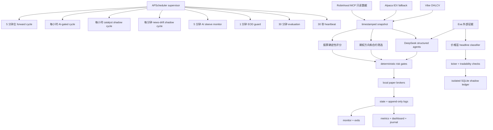

# Auto Trading Skill 项目结构与完整 Pipeline

## 1. 项目是什么

`auto-trading-skill` 是一个使用真实或接近实时市场数据、但只使用本地虚拟资金成交的美股和 long-premium 期权研究系统。它的目的不是证明某个模型会赚钱，而是把“收集数据、形成候选、研究证据、做出决策、通过风控、模拟成交、管理持仓、退出、记账、评估”连接成可以长期运行和审计的闭环。

项目默认虚拟本金为 `$2,000`。主策略账户同时容纳股票和期权，二者独立记录订单、持仓和绩效，但共享现金、账户总风险和每日入场次数。另有一个独立的 `$2,000` AI-gated sleeve，用来测量 AI 策略，而不污染主确定性策略的结果。

项目目前不能进行真实交易。`config/paper_mode.yaml` 固定声明：

```yaml
mode:
  paper: true
  live_readonly: false
  live_trading: false
```

Robinhood 连接只用于显式 allowlist 内的只读市场数据。项目 broker 只有本地 paper broker，不提供真实订单 review、place 或 cancel 接口。即使 LLM 输出 `buy`，也必须经过 Python 风险引擎，最后只能写入本地虚拟账户。

## 2. 系统中的策略线

系统不是单一 Agent，而是几条目的不同、状态隔离程度不同的策略线。

| 策略 | 当前角色 | 是否可创建本地 paper order | 账户 |
| --- | --- | --- | --- |
| `weighted_relative_strength_v2` | 主股票确定性策略 | 是 | 主账户 |
| `long_directional_options_v2_weighted` | 主 long call/put 确定性策略 | 是 | 主账户 |
| `relative_strength_v1` | 原始股票 baseline | 否，shadow comparison | 无独立资金 |
| `long_directional_options_v1` | 原始期权 baseline | 否，shadow comparison | 无独立资金 |
| `multi_agent_relative_strength_v2_candidate` | 对 active 股票候选做 LLM 对照 | 否，shadow-only | 无独立资金 |
| `exa_deepseek_catalyst_v1` | 独立发现事件和交易机会 | 否，shadow-only | 无独立资金 |
| `llm_news_drift_v1` | 全市场新闻优先的价格盲漂移实验 | 否，shadow-only | 独立参考预算，无账户 |
| `ai_gated_technical_v1` | 技术前排候选加 Exa/DeepSeek 的实验策略 | 是 | 独立 AI sleeve |

主账户的股票和期权可以并行筛选，也可以各自持仓和退出。它们不会各自把账户资金用满，因为 `scripts/risk/shared_portfolio_risk.py` 会同时执行：

- 账户总部署金额上限；
- 股票线部署金额上限；
- 期权线部署金额上限；
- 两条线合计的每日 entry 次数上限；
- open order 预留资金；
- 缺失持仓报价时 fail closed。

AI sleeve 的状态目录、订单、持仓、daily counter、journal 和 metrics 都有独立 namespace。它的收益不能被加到主账户收益中。

## 3. 总体架构



网络调用不会直接运行在长期 supervisor 的主线程中。`scripts/orchestrator/forward_paper_service.py` 通过 `scripts/runtime/subprocess_runner.py` 为每个网络密集型周期启动有硬截止时间的子进程。超时会终止完整子进程树，并在 `logs/runtime_jobs.jsonl` 和 heartbeat 中留下失败证据。

各作业声明自己会使用的资源，例如 `main_account`、`ai_account`、`evidence_store` 和 `news_event_store`。资源冲突时作业会明确记录 `skipped`，而不是同时写同一份状态。EOD guard 同时占用主账户和 AI 账户，以确保临近收盘的退出具有最高一致性。News-drift 只占用自己的 SQLite 资源，不能阻塞或写入任一账户。

## 4. 目录职责

### 根目录

- `README.md`：安装、命令、安全边界和简明运行说明。
- `SKILL.md`：Codex 操作本项目时必须遵守的工作流和安全不变量。
- `PROJECT_ARCHITECTURE.md`：本文件，描述当前真实架构和端到端流程。
- `DEVELOPMENT_LOG.md`：持续追加的开发和运行检修记录。
- `.env.example`：环境变量名称示例，不保存密钥。
- `.env.local`：本机密钥文件，必须由 `.gitignore` 排除并留在版本控制之外，不能提交。
- `requirements.txt`：PyYAML、pytest、APScheduler、jsonschema、pandas、exchange-calendars、requests、pydantic、MCP 等运行依赖。

### `config/`

- `paper_mode.yaml`：模式、初始现金、交易时段、行情 stale 时间和 EOD 退出窗口。
- `equity_universe.yaml`：股票观察池、独立期权观察池、ETF 标识和排除项。
- `strategy_profiles.yaml`：active、baseline、catalyst、multi-agent 和 AI-gated 策略参数。
- `paper_risk_limits.yaml`：股票仓位、交易次数、止损止盈和禁止加仓等规则。
- `options_universe.yaml`：允许的期权类型、21 至 45 DTE、delta、volume、open interest 和 spread 条件。
- `options_risk_limits.yaml`：long-premium、单合约、premium 风险、持仓数和退出规则。
- `shared_risk_limits.yaml`：股票与期权共享的账户部署和每日交易上限。
- `execution_costs.yaml`、`options_execution_costs.yaml`：commission、bid/ask、slippage 和订单有效期。
- `llm.yaml`：provider、模型、thinking policy、超时、重试和各 Agent 调用预算。这里只引用环境变量名，不存 API key。
- `integrations.yaml`：Robinhood、Alpaca、Exa、Vibe、forward runtime 和 replay 参数。
- `evaluation.yaml`：forward session、closed trade、profit factor、drawdown 和 rule violation 的最低晋级条件。

### `scripts/`

- `adapters/`：外部系统边界。负责 Robinhood/Alpaca 行情、Robinhood 期权数据、Exa 证据、Vibe OHLCV 和 Vibe sidecar。
- `agents/`：deterministic investment team、API multi-agent team、catalyst team 和 AI-gated team。
- `news_drift/`：独立 SQLite event ledger、事件关系、shadow proposal 和新闻优先 pipeline。
- `broker/`：Robinhood OAuth MCP capability audit 和严格只读 client。
- `core/`：配置、数据模型、审计、时间戳和公共基础设施。
- `dashboard/`：只读 HTTP dashboard，读取 state/logs 并转换为初学者可理解的摘要。
- `discovery/`：候选发现、event/ticker cooldown、证据 snapshot、catalyst pipeline 和 AI-gated pipeline。
- `evaluation/`：绩效、Agent eval、strategy comparison、outcome label、报告和 API pilot。
- `exit/`：股票退出规则。
- `journal/`：订单、成交、持仓生命周期、每日复盘和交易 journal。
- `llm/`：provider 抽象、strict schemas、prompt、usage 和成本记录。
- `options/`：期权模型、fill model、paper broker、risk gate、Greeks 参考、合约选择和退出。
- `orchestrator/`：one-shot、continuous service、dry run 和 shadow cycle 入口。
- `replay/`：virtual clock、历史 event stream、CSV replay 和 Vibe point-in-time replay。
- `research/`：snapshot 构建、技术研究和候选输入。
- `risk/`：股票 pre-trade 风控、仓位计算和股票/期权共享账户风控。
- `runtime/`：scheduler wrapper、heartbeat、watchdog、process lock、healthcheck 和 subprocess deadline。
- `simulation/`：股票 paper broker、订单状态机、fill model、virtual account 和原子状态持久化。
- `strategies/`：确定性股票和期权方向策略。

### 数据和测试目录

- `schemas/`：market snapshot、agent input/output、order、position、journal 等 JSON Schema。
- `tests/`：风控、成交、重启恢复、无前视、LLM schema、dashboard、options 和集成测试。
- `fixtures/`、`tests/agent_evals/fixtures/`：固定无网络测试数据和 Agent 评估 snapshot。
- `state/`：虚拟账户、订单、持仓、计数器、权重、replay run 和运行锁。它是运行态，不应提交。
- `logs/`：append-only JSONL 审计、决策、订单、成交、模型 usage、runtime jobs 和 journal。它是运行态，不应提交。
- `output/`：生成的报告和临时输出，不是策略源代码。
- `third_party/`：外部项目复用说明和许可证，不把不明来源代码散落到业务目录。
- `graphify-out/`：代码关系图。修改代码后运行 `graphify update .`。

## 5. 时间模型和无前视原则

每个决策输入必须同时保存：

- `snapshot_id`；
- `decision_time`；
- `data_cutoff_time`；
- 行情自己的 `asof`；
- 新闻的 `published_at`、`event_time`、`first_seen_at` 和检索时间；
- 数据源及 provider metadata。

forward cycle 的初始时钟只用于确认交易时段。网络请求结束后，系统会用新的当前时间作为真实决策时钟，防止刚返回的合法行情因为比周期起点晚几秒而被误判为“未来数据”。显式传入 replay 时间时不会这样推进，确保历史测试可重复。

缺失报价、过期报价、异常未来时间戳、ask 小于 bid、异常价差、未完成 OHLCV 或证据时间越过 cutoff 都必须 fail closed。Exa 的 crawl time 不能冒充新闻发布时间。历史 replay 不能读取当前网络新闻。

## 6. Continuous Forward Service

用户在终端运行：

```powershell
.\.venv\Scripts\python.exe -m scripts.orchestrator.forward_paper_service
```

这是当前连续运行的正式入口。它会获取 `state/forward_service.lock`，避免重复启动。第二个进程会明确报出 `forward paper service is already running`。正常停止方式是在启动它的终端按 `Ctrl+C`，supervisor 会关闭 scheduler、终止仍在运行的 worker、写 shutdown 日志并释放 lock。

默认调度为：

- 主 forward cycle：每 300 秒；
- AI-gated discovery：每 3600 秒，另在纽约时间 09:32 做开盘复核；
- catalyst discovery：每 3600 秒，并与 AI cycle 使用错开的启动偏移；
- news-drift worker：每 60 秒解析到期标签；全市场 Exa discovery 独立限流为每 15 分钟最多一次；
- AI sleeve position monitor：每 300 秒；
- EOD guard：每 60 秒；
- performance evaluation：每 1800 秒；
- supervisor heartbeat：每 30 秒。

`scripts/runtime/scheduler.py` 提供了轻量 APScheduler wrapper，适合其他受控任务；当前 continuous service 为了管理多资源 worker，直接构造 APScheduler `BlockingScheduler`。这是当前实现事实，不应把 wrapper 描述成 supervisor 的唯一入口。

`scripts/runtime/healthcheck.py` 分开报告三个层次：`runtime_healthy` 表示进程、状态和 heartbeat 可信；`forward_ready` 表示核心股票 forward 数据可用；`full_forward_evaluation_ready` 表示所有已启用的股票、期权、catalyst、AI-gated 和 news-drift 线路都可用。只靠备用报价维持股票线时会显示 `operational_status=degraded`，不能再把部分运行误读成全系统正常。

## 7. 主股票 Forward Pipeline

一次 `run_once` 按以下顺序进行：

1. 用 NYSE calendar 判断当前是否为 regular session。非正常时段只记录 skip，不交易。
2. 从 `default_watchlist` 读取股票池，从 `options_watchlist` 读取期权标的池，取并集收集行情，避免两条线互相限制候选。
3. 通过 Vibe 获取 point-in-time 日线历史，用 Robinhood MCP 获取 bid/ask。Robinhood 失败时可使用配置好的 Alpaca IEX fallback。
4. 获取 session volume，并建立包含 SPY benchmark、历史收益、成交量、价差、事件时间和持仓状态的 snapshot。
5. 先处理上周期 open orders、成熟的 outcome label、股票退出、期权 open orders 和期权退出。
6. 临近收盘 10 分钟时进入 exit-only，不再创建新 entry。
7. 对股票池同时运行 `relative_strength_v1` shadow baseline 和 `weighted_relative_strength_v2` active score。
8. active v2 把 relative strength、1 日动量、5 日动量、成交量确认、市场 regime 和 chase quality 作为软特征加权。行情有效性、时段、极端追高、已有仓位和二元事件仍是硬 gate。
9. 按分数排序，只取每周期有界的最高候选。
10. 在创建订单前计算共享账户剩余容量。如果目标 notional 不可能通过总上限或股票线上限，记录 skip，不制造 rejected order。
11. 通过股票 deterministic risk gate 后创建 limit order，由 paper broker 根据 ask 和不利滑点决定 filled 或 open。
12. active 执行完成后，最多对一个已筛选候选运行 baseline-gated multi-agent shadow。这样 LLM 延迟不会让 active 行情变旧，也不会改变主策略成交。
13. 写入 decision、order、fill、journal、portfolio snapshot、usage 和 heartbeat。

adaptive weight 不会立刻开始学习。系统需要至少 100 个有效且成熟的一小时 outcome label。标签必须在正常交易时段成熟、同一 ticker/小时不重叠，而且到达时间不能超过目标时间 15 分钟。学习器只调整已有特征权重，不能改变风险限制或引入未来数据。

## 8. 主期权 Pipeline

期权线只允许：

- buy-to-open long call；
- buy-to-open long put；
- sell-to-close；
- 一次最多一张合约；
- fully paid premium，不使用 margin。

它明确拒绝 short option、sell-to-open、spread、0DTE、加仓摊低、exercise 和 assignment。

处理步骤为：

1. 只对独立 `options_watchlist` 构建 snapshot。该列表优先选择一张标准 100 股合约仍可能落入小账户预算的普通股票和 ETF。
2. `long_directional_options_v2_weighted` 分别计算 bullish 和 bearish score。SPY regime 是软特征，公司级重大负面事件和明显相对弱势可以在大盘非 risk-off 时支持 long put。
3. 读取 earnings calendar。临近二元事件且不符合策略规则时 fail closed。
4. 从 Robinhood 只读 option chain 中按 21 至 45 DTE、绝对 delta 0.30 至 0.65、volume、open interest、spread、IV 和 Greeks 过滤。
5. 使用账户净值 10% 附近的 premium risk budget 过滤一张合约成本，并同时检查期权线 20% 和账户总 60% 部署上限。
6. 选择最接近目标 DTE/delta 且流动性可接受的合约。诊断日志保存每类拒绝数量、最低可用 premium 和预算缺口。
7. option limit buy 使用 ask 加不利滑点；limit sell 使用 bid 减不利滑点。限价不可达到时订单保持 open，不能用 midpoint 假设成交。
8. monitor 处理 stop loss、take profit、最大持有天数、临近到期和收盘前退出。

当前没有模拟行权、指派、实物交割、组合保证金或 multi-leg spread。为了不让这些缺失变成隐含风险，持仓必须在 expiry/sellout 前强制平仓。当前也没有可用于策略晋级的完整历史期权 replay，期权有效性主要依赖 forward paper 数据。

## 9. LLM 和 Multi-Agent Pipeline

`scripts/llm/base_provider.py` 定义统一 provider contract。业务 Agent 不直接依赖 DeepSeek SDK。`api_provider.py` 使用 OpenAI-compatible API，`mock_provider.py` 提供确定性测试，`local_provider.py` 只保留未来本地模型接口。

API key 只能从环境变量读取。每次调用记录 model、prompt version、输入/输出 token、latency、estimated cost、错误和 retry count。strict JSON Schema 校验失败时不能把自由文本当作交易结论。

角色划分为：

- Regime Agent：确定性 Python，不调用 LLM；
- Technical/Relative Strength Agent：确定性 Python，不调用 LLM；
- News/Bull Agent：读取已有 snapshot 和 Exa evidence，输出结构化事件；
- Challenge Agent：寻找反例、证据矛盾、陈旧信息、追高和 event risk，可以建议 veto；
- Decision Manager：只能输出 `buy`、`hold`、`exit` 或 `no_trade` 及结构化条件；
- Deterministic Risk Gate：最终 veto，永远位于 LLM 之后。

thinking 只用于需要深入反证或最终综合的有限调用。若 thinking 因输出长度无法提供结构化 JSON，retry 会关闭 thinking 并要求简洁 schema 输出。模型永远拿不到 broker client，也不能修改 YAML。

## 10. Catalyst Shadow Pipeline

`exa_deepseek_catalyst_v1` 不依赖股票 active strategy 先产生 buy。它组合 core watchlist、earnings、已有 Robinhood saved scans 和 bounded Exa market query，形成最多 30 个候选，再低成本排名，最多对 3 个候选做深度研究。

Exa 负责外部非结构化证据，不替代报价、historicals、fundamentals、earnings、liquidity 或 tradability。证据按 URL、event fingerprint 和 content hash 去重，并写入不可变 timestamped snapshot。同一 ticker 两小时内没有新事件时不重复完整研究，同一事件默认冷却 24 小时。

这条线目前永远是 shadow-only。它会形成 equity 或 long-option proposal 并运行 deterministic risk veto，但 `paper_orders_created` 必须为 0。当前使用 Exa Search 和 inline highlights；没有使用 Exa Agent、Monitors 或单独的 Contents pipeline，因为调度、状态和 Agent 综合已由本项目负责。

## 11. AI-Gated Executable Paper Pipeline

`ai_gated_technical_v1` 用独立 sleeve 评估“AI 是否在确定性技术候选中增加价值”。它不是主策略的自动替代品。

1. 从 read-only watchlist、scanner、earnings 和市场数据形成候选。
2. Python 同时计算 bullish 和 bearish 技术分数，选择前 5 至 8 个有界候选，并为已确认的财报 surprise 保留少量位置。
3. Exa 对候选做有限并行搜索，DeepSeek 先做一次低成本结构化排序。
4. 对最多两个深度候选补充 primary-source evidence。
5. 运行 News/Bull、Challenge 和 Decision。Challenge 可以 veto，Decision 可以 no-trade。
6. 对置信度、ticker、数据时间、股票或期权方向再次做 deterministic validation。
7. 股票 proposal 进入 sleeve 的股票 risk gate；期权 proposal 进入 sleeve 的 option selection 和 shared risk gate。
8. 只有所有检查通过才写本地 paper order，之后由独立 monitor 管理退出。

盘前 90 分钟允许生成 research-only plan，但不能下单，也不消耗可执行 event cooldown。09:32 的作业会用新行情重新运行研究和风险检查，并不是无条件照搬盘前结论。

## 11.1 News-First LLM Drift Shadow Pipeline

`llm_news_drift_v1` 与主股票、期权、catalyst 和 AI-gated 都隔离。它不先读取固定 watchlist，也不要求技术策略先产生 buy candidate。worker 每分钟解析标签，但全市场 Exa query 每 15 分钟最多运行一次；结果保存为不可变 raw snapshot，并按 URL、content hash 和 event fingerprint 去重。同一事件在 24 小时 cooldown 内不会反复发送给模型。

唯一的 LLM 阶段是 `NewsDriftHeadlineAgent`。输入只有 headline、published time、source、source tier、可选 ticker/company hint 和最近事件标题；没有 price、quote、volume、technical、position 或 account。strict output 同时完成 ticker mapping、方向、事件类型、materiality、novelty、ambiguity、confidence 和 event relation。`duplicate` 不再产生 signal；`material_update` 和 `contradiction` 可以重新评估。

完成模型调用后，Python 才验证 exact US-listed instrument，并从 Robinhood 读取 fundamentals、historicals 和 bid/ask。stale/future quote、低流动性、小市值、宽价差、signal latency、缺少 pre-event reference 或 initial reaction 过大都会 deterministic reject。只有日期而没有时分的发布时间会保留原值，但使用 `first_seen_at` 作为保守可交易时间；盘前只因 stale quote 被拒的信号会在开盘后用新行情重验，不重复调用 LLM。第一阶段只有正面事件能够形成 long-equity shadow proposal；负面事件只保存，留给独立的 synthetic short 或 long-put 研究。

proposal 的参考本金为 `$2,000`，单笔最多 25%，entry 使用 ask 加不利滑点。它只写 `state/news_events.sqlite`、`logs/news_drift_*` 和 `logs/news_drift_snapshots/`，没有 paper broker、orders 或 positions。收益标签按 +1m、+5m、+15m、same-day close、next close 和 second close 分开，退出按 bid 减不利滑点。

评估分别报告 event、firm-day 和 portfolio-day 的 gross/net return、hit rate、profit factor、observed cost、break-even cost 和成本敏感性。至少 100 个有效标签及 20 个 portfolio day 之前只能显示 `insufficient_forward_evidence`；配置为 shadow-only 时永远不能自动晋级。完整政策、Exa 功能取舍、论文复现边界和 P2 隔离实验见 `references/llm_news_drift_policy.md`。

## 12. 订单、成交和账户记账

股票和期权订单都支持以下生命周期：

```text
created
submitted_to_paper_broker
open
partially_filled
filled
cancelled
expired
rejected
```

第一版通常不会主动产生部分成交，但模型和持久化结构支持 `partially_filled`。`created` 绝不等于持仓。只有 fill 被原子应用到账户和 positions 后，系统才增加持仓和交易计数。

股票买入成交价基于 ask 加不利滑点；卖出基于 bid 减不利滑点。期权使用真实合约 bid/ask 和单独配置的不利滑点。limit 不可达到时订单保持 open，之后由新报价重试、过期或取消。

账户、positions、orders 和 counters 使用原子文件替换保存。JSONL 审计使用跨进程锁和 durable append。idempotency key、duplicate order gate、已有持仓 gate 和禁止 average down 共同阻止重复下单。

## 13. Monitor、Exit 和 EOD

股票和期权各自有退出规则。退出判断仍需要新鲜 bid/ask；缺失价格时不能假设以 last 或 midpoint 平仓。

主 forward cycle 每五分钟先监控持仓再寻找新 entry。AI sleeve 有独立的五分钟 monitor，所以即使一小时 discovery 尚未运行，它的现有持仓仍会管理。EOD guard 每分钟检查两个账户，在临近收盘时处理退出，并在重启后修复跨夜残留状态。

当前设计目标是日内或短持有期 paper evaluation，不允许策略依赖未实现的隔夜期权交割行为。

## 14. Journal、Metrics 和 Dashboard

每个决策和订单会留下当时看见的数据时间、策略名、thesis、支持证据、反方证据、风险结论、成交信息和退出原因。主要日志为 append-only JSONL，便于按时间重建事件。

`calculate_metrics.py` 分别统计股票、期权和聚合结果，包括：

- net return 和 realized PnL；
- closed trade 数和 win rate；
- profit factor；
- max drawdown；
- filled/open/expired/rejected order 数；
- executable order 的 fill rate 和 unfilled rate；
- rule violation；
- LLM latency、token 和 estimated cost；
- baseline、AI sleeve 和 shadow decision comparison。

deterministic risk rejection 不再被计入“未成交率”的分母，因为它从未进入市场执行生命周期；它仍作为独立 rejected count 和风险诊断保留。

dashboard 是只读视图。它不启动服务、不修改策略、不下单，只从 `state/` 和 `logs/` 生成初学者摘要。服务和 dashboard 应在两个终端分别启动。

## 15. Historical Replay 和 Forward Evaluation

项目有两类历史路径：

- `scripts/replay/replay_run_manager.py`：基于 CSV event stream、virtual clock、原始 deterministic investment team 和 paper broker 的基础 replay。
- `scripts/replay/vibe_replay_run_manager.py`：基于 Vibe 5 分钟 OHLCV，合成不利 top-of-book，并复用股票 broker、risk、fill、exit 和 journal。

当前 Vibe replay 的 entry strategy 仍是 `relative_strength_v1`，不是 active `weighted_relative_strength_v2`，也不包含完整期权 replay。因此“replay 与 forward 使用完全相同 active strategy”尚未实现。历史结果只能发现明显错误，不能替代 forward paper evidence。

最终晋级判断以 `config/evaluation.yaml` 为准，默认至少需要：

- 20 个 forward session；
- 30 笔已平仓交易；
- 正 net return；
- profit factor 至少 1.2；
- 最大回撤不超过 10%；
- 0 个 risk rule violation。

达到这些数字也只表示“值得继续验证”，不表示未来盈利得到保证。

## 16. 外部组件边界

- Robinhood MCP：项目自有 OAuth client，只允许显式只读方法。完整 capability manifest 也包含交易工具，但 generic call 不对业务代码开放，写工具不在 allowlist。
- Alpaca：当前作为 Robinhood equity quote 的备用来源，默认 IEX feed，不应描述成完整 SIP。
- Exa：用于 recent external evidence、market/ticker search 和 highlights，不作为价格源。
- Exa Search 的 inline Contents highlights 已使用；Deep Search、Exa Agent、Monitors 和独立 Contents endpoint 尚未接入，避免把额外延迟放进一分钟关键路径。
- DeepSeek：通过 provider-neutral OpenAI-compatible HTTP API 使用，主要用于 News、Challenge、Decision 和 bounded ranking。
- Vibe-Trading：固定 commit，通过隔离 subprocess adapter 提供 OHLCV、独立 backtest 和可选 read-only research sidecar；没有把整个上游源码复制进业务目录。
- APScheduler：负责时间调度；heartbeat、process lock、resource conflict、hard timeout、state recovery 和 fail-closed 由项目代码负责。
- LangGraph：当前未引入。确定性 pipeline 尚不需要复杂 graph checkpoint、human approval 或长期条件图。

## 17. 当前明确限制

1. 当前累计 forward 数据不足，尚无稳定盈利证据。
2. 一张标准期权合约代表 100 股，`$2,000` 账户和 10% premium cap 会让许多高价标的天然不可交易。独立低价观察池改善覆盖，但不保证产生合格合约。
3. 没有 short option、spread、margin、exercise、assignment、实物交割或 portfolio margin 模拟。
4. 没有完整 active v2 股票加期权 historical replay。
5. AI-gated 策略目前大多输出 no-trade，尚无足够成交可评价盈利性。
6. catalyst 策略只有 shadow proposal，不能用它的决策结果宣称 paper PnL。
7. news-drift 刚进入 forward shadow 收集阶段，尚无足够 event、firm-day 或 portfolio-day 样本；Exa 搜索费用在未配置合同单价时仍是 unpriced。
8. 官方论文 replication package 尚未下载和独立复现；当前指标只是为该复现预留兼容聚合口径，不能称为论文复现结果。
9. saved Robinhood scans 只有用户已创建时才能产生候选，项目不会创建或修改 scanner。
10. Alpaca IEX 和部分第三方历史源不等于全市场 consolidated feed，成交模拟精度仍有限。
11. dashboard 是解释层，不是账户真相。发生冲突时，以 state、append-only logs、runtime heartbeat 和 paper broker ledger 为准。

## 18. 开发和验证顺序

每次改变策略或运行代码，应按以下顺序进行：

1. 保持 `paper=true` 和 `live_trading=false`，检查改动没有新增真实 broker 写方法。
2. 用临时 root 和 mock provider 运行相关单元测试，不能污染真实 `state/`。
3. 运行全量 pytest。
4. 运行无网络 dry run，验证 research、risk、broker、fill、exit、journal 和 metrics 闭环。
5. 用 `--readiness` 和 `scripts.runtime.healthcheck` 做只读运行检查。
6. 如果 continuous service 正在运行，不从其他进程执行 state-mutating one-shot。由用户在原终端 `Ctrl+C` 后重启。
7. 更新 `DEVELOPMENT_LOG.md`，记录证据、文件、测试和是否需要重启。
8. 运行 `graphify update .`，使知识图与代码保持一致。

这个顺序的核心原则是：先证明数据和状态可信，再讨论策略收益；先保留拒绝和失败证据，再调整门槛；任何模型结论都不能替代确定性风险和 paper broker 账本。
