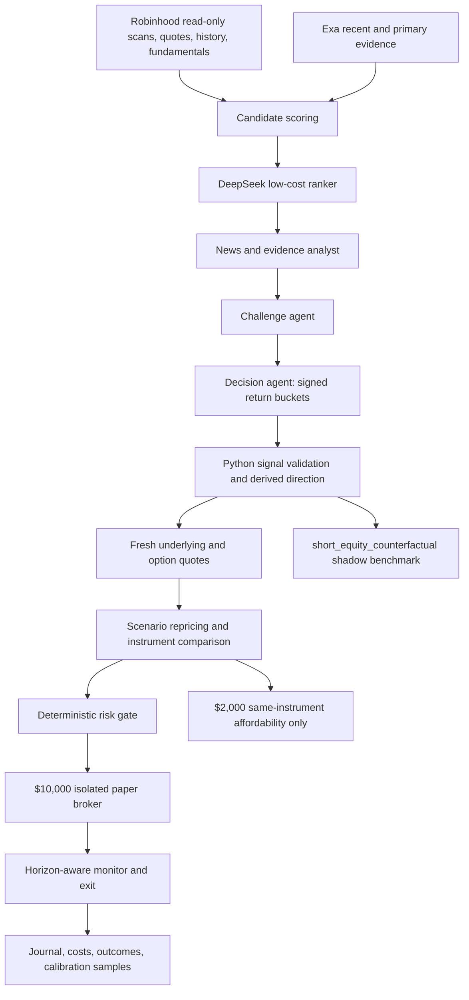

# AI Instrument Allocator V1 Design

**Date:** 2026-08-19  
**Status:** Approved  
**Scope:** Equity and long-premium option paper trading only

## 1. Objective

Add an isolated, executable paper strategy named `ai_instrument_allocator_v1`.
It uses a $10,000 virtual sleeve to compare a long equity position with an
eligible long call or long put after evidence review, conservative scenario
repricing, execution costs, and deterministic risk checks.

The strategy must improve the quality of forward evidence without rewriting
any existing paper account, order, fill, PnL, journal, or audit record. It must
never call a live Robinhood order tool.

## 2. Non-goals

- No live trading, margin, leverage, naked options, option spreads, exercise,
  assignment, or short option positions.
- No model training or probability calibration fitting in this change.
- No probability-weighted EV while model probabilities remain uncalibrated.
- No replacement or migration of the existing $2,000 ledgers.
- No second allocator for the $2,000 affordability comparison.

## 3. Strategy Lifecycle

### 3.1 Existing strategies

`long_directional_options_v2_weighted` and `ai_gated_technical_v1` are placed
in entry-frozen mode:

- They create no new paper entry orders.
- Their existing open orders continue through their existing fill, expiry, and
  cancellation handling.
- Their existing positions continue through their existing monitor, stop,
  take-profit, time-stop, and EOD exit logic until flat.
- Their state directories and append-only logs are never migrated or rewritten.

`relative_strength_v1` and `long_directional_options_v1` remain unchanged as
deterministic comparison baselines.

### 3.2 New isolated sleeve

`ai_instrument_allocator_v1` uses:

- state namespace: `ai_instrument_allocator_v1`
- initial virtual cash: `$10,000`
- independent account, positions, orders, fills, mandates, decisions, and PnL
- shared equity and option risk limits inside that sleeve
- no shared account or order state with the legacy $2,000 account or old AI sleeve

State initialization accepts an explicit sleeve initial cash value. Existing
state files win over configuration, so restarting can never reset an account.

## 4. End-to-end Pipeline



### 4.1 Two-speed research schedule

- `20:00 ET`: full slow research, primary evidence, challenge, and conditional
  plans. Thinking is enabled only for the overnight Challenge and Decision calls.
- `08:00 ET`: incremental Exa evidence refresh and fast plan revalidation.
- `09:25 ET`: final pre-open evidence invalidation pass.
- `09:32 ET`: no LLM call; fetch fresh quotes, rebuild executable economics,
  run deterministic risk, and optionally submit to the paper broker.
- Regular-session discovery may run at a bounded interval. It uses the fast,
  non-thinking model path and the same deterministic allocator.

An overnight or premarket plan can never create an order. Every executable
entry receives a fresh quote and a deterministic authorization window no longer
than 300 seconds.

The model must set `entry_now=false` outside regular hours. That value prevents
research-time execution; it does not discard a saved conditional plan. At the
open, only a plan carrying an `overnight`, `premarket_update`, or
`preopen_revalidation` source stage may proceed to fresh executable economics
and deterministic risk. The open-execution window is 09:32 through 09:37 ET;
late calls and plans originating from `intraday` are rejected. New completed analysis for the same ticker supersedes
the older plan, while no-trade or fail-closed analysis invalidates it. Events
included in a successful ranking enter cooldown even when they are outside the
deep-analysis top set or the final action is no-trade. Failed ranking can be
retried but cannot create a plan or order.

## 5. Model Output Contract

The core prediction is one horizon and one complete set of mutually exclusive
signed return buckets:

```text
return_lt_minus_5_pct
return_minus_5_to_minus_2_pct
return_minus_2_to_minus_0_5_pct
return_minus_0_5_to_plus_0_5_pct
return_plus_0_5_to_plus_2_pct
return_plus_2_to_plus_5_pct
return_gt_plus_5_pct
```

Each value is within `[0, 1]`; Python rejects the signal unless all seven keys
are present and their sum is within `1e-6` of 1. The output also contains:

- `horizon`: `intraday_close`, `next_close`, or `two_to_five_days`
- thesis, evidence, contrary evidence, data gaps, entry condition, invalidation
  condition, thesis validity, and a no-trade reason
- `probability_status: uncalibrated`

The model does not output a final instrument. Python derives bullish, bearish,
and neutral mass, the dominant signed bucket, and conservative move scenarios.
The raw values may be logged and used as ordinal ranking features, but they are
not treated as true probabilities and are never inserted into an EV formula.

## 6. Probability Calibration Contract

Calibration is separated by horizon. Every raw prediction records:

- model and prompt version
- decision time and data cutoff time
- label maturity time
- horizon and signed bucket vector
- `calibration_status`
- calibration version, training cutoff time, and sample size

Before training, calibration metadata is explicitly `uncalibrated`, version
`none`, with no training cutoff and sample size zero.

Future expanding walk-forward calibration may train only on labels whose
`label_matured_at` is no later than that fold's training cutoff. Random splits
are prohibited. Promotion is based primarily on out-of-sample Brier score and
log loss against the uncalibrated model and a historical-base-rate reference.
ECE and reliability curves are diagnostics, not a standalone promotion gate.

## 7. Deterministic Instrument Allocation

### 7.1 Direction

Python sums the three negative buckets, the neutral bucket, and the three
positive buckets. Direction must pass configured dominance and margin floors.
Otherwise the result is `no_trade`.

- bullish: compare long equity and eligible long calls
- bearish: compare eligible long puts; long equity is not a bearish instrument
- neutral or ambiguous: no trade

### 7.2 Option candidates

The read-only Robinhood adapter returns a bounded set across configured DTE
windows instead of selecting one contract before economics are known. Entry
filters require quotes, IV, Delta, Gamma, Theta, Vega, volume, open interest,
and acceptable spread.

- preferred spread: at most `1.5%`
- hard spread limit: at most `2.0%`
- one contract per order

### 7.3 Scenario repricing

Multi-day option comparison cannot use only a Delta/Gamma/Theta local
approximation. Each option is anchored to its observed market midpoint and
repriced under combinations of:

- the derived conservative underlying move
- remaining time at the selected horizon
- configured IV contraction, unchanged-IV, and IV-expansion scenarios

Black-Scholes is used as a transparent scenario engine. The change in model
price is applied around the observed market midpoint. Delta, Gamma, Theta, and
Vega are retained as sensitivity diagnostics; conservative repriced outcomes,
break-even move, bid/ask spread, adverse slippage, tick rounding, and commission
drive comparison.

Until calibration is promoted, outputs use `scenario_net_return` and
`break_even_move`, while `probability_ev_available` is false and probability EV
fields are null.

## 8. Risk Controls

The deterministic risk engine remains the final veto.

- equity single-position notional: at most 25% NAV
- equity aggregate notional: at most 50% NAV
- equity planned-stop loss: at most 1% NAV
- option premium risk per entry: at most 3% NAV
- aggregate option premium risk: at most 8% NAV
- aggregate deployed capital: at most 60% NAV
- total executable positions: at most 3
- total entries per session: at most 3
- one executable exposure per underlying across equity and options
- no adding to positions or averaging down
- no same-session re-entry after stop loss or thesis invalidation
- missing quote, stale quote, missing IV/Greeks, invalid mandate, or inconsistent
  state fails closed

An equity order carries a deterministic planned stop price. The paper broker
risk gate independently checks both its notional and planned-loss NAV limits.

## 9. $2,000 Counterfactual

The counterfactual runs only after the $10,000 allocator selects an instrument.
It evaluates that exact equity or exact option contract under a hypothetical
$2,000 NAV and the same risk rules. It records:

- selected instrument identity
- affordability
- maximum affordable quantity
- proposed risk dollars and percent of hypothetical NAV
- deterministic rejection reason

It cannot request another option chain, choose another strike or expiration,
change direction, create a second proposal, create an order, or affect the
$10,000 allocation.

## 10. Bearish Benchmark

The name is `short_equity_counterfactual`. It is a hypothetical direct short of
the underlying used only to compare bearish signal quality with long-put
execution drag. It has isolated shadow records and metrics, creates no account
state or order, and is never merged with long-put PnL.

## 11. Position Mandates and Exit

Every new filled position has a persisted mandate containing strategy version,
snapshot, ticker, instrument, horizon, entered time, planned exit time, thesis
validity, invalidation condition, and stop information.

- `intraday_close`: exit before the same session close
- `next_close`: exit before the next trading-session close
- `two_to_five_days`: hold only through the chosen 2-5 trading-day horizon
- missing, inconsistent, or expired mandate: exit before the current close

Price stop, take profit, thesis invalidation, liquidity failure, broker sellout,
and expiry rules may exit earlier. Mandate state is restart-safe; all mandate
changes also emit append-only audit events.

Legacy strategy positions do not receive migrated mandates and continue using
their original exit rules.

## 12. Observability and Accounting

New immutable logs include raw signal, evidence snapshot, allocation scenarios,
risk decision, $2,000 counterfactual, mandate lifecycle, fills, and calibration
sample metadata. Every record includes decision time and data cutoff time.

Closed-trade reporting decomposes:

```text
gross midpoint PnL
- spread cost
- adverse slippage and tick cost
- commission
= executable net PnL
```

An invariant residual detects accidental double counting. Dashboard and reports
show the new sleeve separately from every legacy account.

## 13. Safety and Acceptance Tests

Required tests cover:

- legacy strategies reject new entries but continue open-order and position exits
- no historical state or log migration
- exact $10,000 account initialization and restart recovery
- exact same-instrument $2,000 counterfactual with no reselection
- complete signed buckets, sum-to-one validation, and Python-derived direction
- raw probabilities never used in probability EV
- horizon-separated, maturity-safe walk-forward splits
- option repricing responds to spot, time, IV, and Vega diagnostics
- 1.5% preferred and 2% hard option spread behavior
- equity notional and planned-stop NAV limits
- 3% option entry and 8% aggregate option limits
- three-position and three-entry limits
- one executable exposure per underlying
- same-session stop/invalidation re-entry block
- conditional plans never order before regular-session revalidation
- horizon-aware exits recover correctly after restart
- `short_equity_counterfactual` remains shadow-only and separate from put PnL
- append-only audit and exact cost identity
- paper mode never exposes or calls Robinhood write tools
