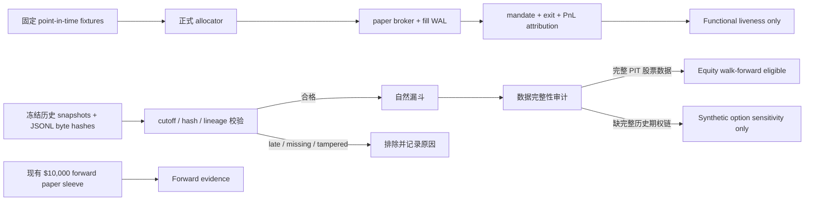

# AI Instrument Allocator 历史验证体系

## 目的与边界

这套验证只服务于 `ai_instrument_allocator_v1`，不改变 forward 策略参数、
risk limits、prompt、schema 或现有 `$10,000` paper 账本。它把三种证据严格
分开：

1. `functional_liveness`：固定 fixture 能否经过正式生产路径；
2. `strict_historical_diagnostic`：历史时点数据能否形成无未来数据的自然漏斗；
3. `forward_paper_evidence`：当前模型在真实向前 paper 运行中的实际结果。

第一类只证明系统能运行。第二类只有在数据完整时才可扩展为历史绩效回测。
第三类才是当前模型盈利能力的直接证据。历史 LLM 输出只作 diagnostic 或
comparative evidence，不能证明当前模型盈利。



## Golden-path functional replay

`bullish_equity`、`bullish_call` 和 `bearish_put` 三个固定 fixture 使用正式
`AiInstrumentAllocatorPipeline`、instrument allocator、deterministic risk gate、
股票/期权 paper broker、fill WAL、position mandate、monitor、exit 和 metrics。
每个场景完整检查：

```text
proposal -> plan -> preopen revalidation -> allocation -> risk
-> paper order -> fill -> WAL -> mandate -> exit -> closing fill
-> closed mandate -> realized PnL attribution
```

每次运行复制 versioned config 到独立 `TemporaryDirectory`。任何 state、order、
fill 和 journal 都只写临时 root；结束后临时目录删除。fixture provider 不连接
外部 LLM、Exa、Robinhood 或 Alpaca。runner 在 MCP `call_tool` 和只读 broker
adapter 两层安装 live-order deny/spy hook，并核验运行时 broker 的 concrete class
确实是 `PaperBroker` / `OptionPaperBroker`；因此 0 write call 来自可观察计数，
不是写死常量。fixture
中的正 PnL 是测试数据，不是历史或 forward 盈利证据。risk trace 同时要求
allocator 选中候选、候选通过 deterministic eligibility、风险金额为正、paper
broker 风控后接受；WAL 还会逐笔核对 entry/exit order ID，而不是只数两条记录。

```powershell
.\.venv\Scripts\python.exe -m scripts.replay.allocator_functional_replay --root .
```

## Natural strict historical replay

strict runner 只读取指定 root 的不可变 evidence snapshots 和 allocator JSONL。
`--asof` 必须显式提供，不能使用当前 wall clock 推断历史 cutoff。每个 JSONL
只读取一次到内存并记录那一份 byte hash；snapshot 同时验证 canonical hash、
文件名 hash 前缀、reference hash 和 source-root confinement。

新 snapshot 直接保存 `data_cutoff_time`、`retrieved_at` 和独立的
`snapshot_written_at`。旧 snapshot 只有在某条 decision 以完全相同的 path/hash
引用它，并且该 decision 本身保存了明确 `data_cutoff_time` 时，才可临时使用这条
linked cutoff 进行验证；历史文件本身不会被补写或迁移。没有唯一 linked cutoff
的旧记录一律排除。

纳入漏斗前必须满足：

- observation timestamp 不晚于该 snapshot 的 decision/data cutoff；
- snapshot reference path、hash 和窗口匹配；
- 初始 decision 有同 snapshot 的 deep-research 祖先、显式 decision identity 和 cutoff；
- plan 显式保存 `source_decision_id`、cutoff 和 snapshot reference，必须绑定同一条
  proposal；premarket/preopen plan version 还必须绑定已接纳的 prior plan；
- allocation 关联该 plan，且自身 observation 不含未来数据；
- order 只来自 admitted selected allocation；
- fill 只关联 admitted order，instrument identity 一致且不晚于 replay `asof`；
- 冲突的 duplicate decision、plan、allocation 或 order identity fail closed；同一
  plan ID 的有序 revalidation version 作为版本更新处理，不误判为第二个 plan；
- quote、OHLCV、news 和 option observation 的必要时间戳缺失时 fail closed。

任何层失败都会级联排除后代。缺值保持缺值；runner 不导入 current market-data
adapter，不调用 LLM 或 broker，不生成、提交或改写历史订单。Issue #3 的
`observed_audit_funnel` 保留为独立字段，并标记
`legacy_issue_3_decision_time_diagnostic` 和 `comparable_to_strict_funnel=false`，
不能与 strict funnel 混用。
当前模式复核的是 recorded historical outputs；它不会伪装成“用当前模型重新
执行了历史决策”。报告固定保存 current source/prompt/schema/config/model
manifest，但明确记录 `strategy_reexecution_performed=false`。

```powershell
.\.venv\Scripts\python.exe -m scripts.replay.allocator_historical_replay `
  --root . `
  --project-root . `
  --hours 48 `
  --asof 2026-08-26T18:13:07+00:00

.\.venv\Scripts\python.exe -m scripts.replay.allocator_validation_report `
  --project-root . `
  --data-root . `
  --hours 48 `
  --asof 2026-08-26T18:13:07+00:00 `
  --output reports/allocator_validation_latest.json
```

输出被禁止写入 `state/` 或 `logs/`。`reports/*.json` 是 machine-local runtime
artifact，不进入 Git。Dashboard 只读取预生成报告，不在 HTTP 请求中启动
replay、模型或 broker。

## 数据完整性与允许的结论

股票 executable backtest 至少要求每个时点有：

- point-in-time `bid`、`ask` 和 quote timestamp；
- 有限、未 crossed 的 top-of-book；
- OHLCV timestamp、open、high、low、close、volume；
- 明确 `corporate_action_safe=true` 和 `coverage_complete=true`。

期权 executable backtest 还要求当时完整 chain，并明确
`chain_complete=true`，并保存 expected/received contract count、expiration
coverage 和 strike coverage。chain 还必须保存 source、request/dataset identity、
capture timestamp、pagination completeness 和实际 query 的 underlying、expiration、
strike 范围；received count 必须与不可变 snapshot 中的 contracts 数量一致。每个合约需要 contract/chain identity、underlying、
call/put、strike、expiration、bid/ask、IV、Delta、Gamma、Theta、Vega、volume、
open interest 和更新时间。缺少任一部分时，只允许报告
`synthetic_option_sensitivity`，不得声称 executable option PnL。

## Walk-forward 规范

`build_walk_forward_partitions()` 支持 `expanding` 和 `rolling`。每个 horizon
独立运行；development、calibration、final holdout 互斥。训练行必须满足：

```text
training decision time < test decision time
label_matured_at <= test decision time
```

final holdout 永不参与模型选择或 calibration。将来真正的 profitability
backtest 还需要固定 dataset manifest、数据授权/source/feed、coverage 和
corporate-action adjustment policy；开发、校准与 final holdout 的结果分别报告。
当前报告会列出 `walk_forward_readiness`。其中
`partition_contract_requires_*` 表示规范要求；
`development_calibration_holdout_separated`、`matured_labels_only`、
`actual_partitions_run` 和 `leakage_checks_run` 只表示本次是否真的执行。没有
point-in-time outcome labels 时，这些 executed 状态均为 false；缺完整期权链只限制 executable
option PnL，不会在股票数据完整后阻止独立 equity backtest。

## 2026-08-27 实测只读诊断

截至 `2026-08-27T06:25:50Z` 的 48 小时输入：

- observed funnel：40 candidates、33 ranking、15 deep research、16 decisions、
  7 proposals、5 allocations、1 selected、1 paper order、1 fill；
- strict funnel：12 unique candidates、12 ranking/deep research、12 decisions、
  6 proposals、0 admitted allocations、0 orders、0 fills；
- 161/161 份历史 snapshot hash 和 envelope 有效。窗口内 41 份 snapshot 中
  16 份可通过 exact decision link 恢复 cutoff，25 份缺少唯一可证明 cutoff；
  另有 7 条旧 decision 缺显式 record cutoff。相关后代全部排除，admitted
  `time_violation_count=0`；
- replay 创建历史订单 0，live broker write calls 0；
- golden functional replay 为 3/3 passed；
- replay 前后会 hash allocator state、allocator logs 和 immutable snapshots 下的
  **全部文件类型**，不再只检查 `.json/.jsonl`；该次快照的 182 个文件未变化；
- 当前 `$10,000` forward sleeve 为 0 个 closed trades、1 个 open position、
  realized PnL `$0.00`，结论仍是 `insufficient_forward_evidence`；
- 16 条 strict-admitted equity rows 都缺完整 OHLCV，且没有完整 PIT option chain 或成熟标签
  dataset，因此 walk-forward 状态为 blocked。当前允许的历史结论只有 synthetic
  option sensitivity，不能报告 executable equity 或 option historical PnL。

这些数字是该 cutoff 的诊断快照，会随新的 forward evidence 改变。

## Dashboard 解读

总览新增“三种证据不要混淆”：

- **功能闭环**：三条 fixture 是否跑通；
- **严格历史证据**：strict funnel、排除数量和数据完整性；
- **真实向前模拟**：现有 isolated paper sleeve 的 closed trades 与 PnL。

期权数据不完整时，页面明确标注 synthetic sensitivity 为“不可执行估算”，
不会把它显示成历史期权收益。Dashboard 只接受通过正式 JSON Schema 校验的
预计算 validation report；HTTP refresh 不再现场执行 allocator policy replay。
